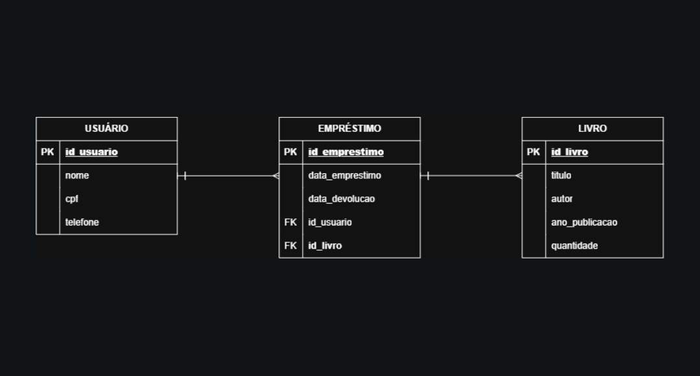

# sistema-biblioteca-np1
Projeto de Banco de Dados NP1 - Sistema de Biblioteca com CRUD.

1. Identificação Institucional

 * Curso: Ciência da Computação
 * Integrantes:
 
 * Nome: Adryel Miranda da silva - RA: R803Fj8 - Turma:CC4P17
 * Nome: Matheus dos Santos Ribeiro Aguiar - RA: H785480 - Turna:CC3P17
 * Nome: Gabriel Barbosa Rodrigues - RA: R852HH7 - Turma: CC4P17
 * Nome:

2. Descrição do Projeto

Tema: Sistema de Gerenciamento de Biblioteca (Controle de Usuários, Livros e Empréstimos).
Regras de Negócio e Escopo Funcional:
O sistema permite o cadastro completo de usuários, controle do acervo de livros disponíveis e o registro de empréstimos e devoluções.
Cada empréstimo está vinculado obrigatoriamente a um usuário cadastrado e a um livro existente no acervo.
O controle de estoque (quantidade de livros) é atualizado de acordo com a disponibilidade das obras.

3. Modelagem de Dados

Diagrama Entidade-Relacionamento (DER)
Abaixo está o DER que ilustra o relacionamento conceitual e lógico entre as entidades `Usuario`, `Livro` e `Emprestimo`:


Scripts DDL
```sql
-- ==========================================================
-- SCRIPT DDL - SISTEMA DE BIBLIOTECA
-- Descrição: Criação do banco de dados e tabelas relacionais
-- ==========================================================

-- Criação do banco de dados
CREATE DATABASE Biblioteca;
GO

-- Seleciona o banco que será utilizado para as próximas operações
USE Biblioteca;
GO

-- ----------------------------------------------------------
-- Tabela: Usuario
-- Armazena os dados cadastrais dos usuários da biblioteca
-- ----------------------------------------------------------
CREATE TABLE Usuario (
    id_usuario INT PRIMARY KEY,         -- Identificador único do usuário (Chave Primária)
    nome VARCHAR(100) NOT NULL,         -- Nome completo do usuário
    cpf VARCHAR(11) NOT NULL,           -- CPF do usuário (documento de identificação)
    telefone VARCHAR(15)                -- Telefone de contato
);
GO

-- ----------------------------------------------------------
-- Tabela: Livro
-- Armazena o acervo de livros disponíveis na biblioteca
-- ----------------------------------------------------------
CREATE TABLE Livro (
    id_livro INT PRIMARY KEY,           -- Identificador único do livro (Chave Primária)
    titulo VARCHAR(150) NOT NULL,       -- Título da obra
    autor VARCHAR(100) NOT NULL,        -- Nome do autor
    ano_publicacao INT,                 -- Ano em que o livro foi publicado
    quantidade INT NOT NULL             -- Quantidade de exemplares disponíveis em estoque
);
GO

-- ----------------------------------------------------------
-- Tabela: Emprestimo
-- Registra as transações de empréstimos de livros aos usuários
-- ----------------------------------------------------------
CREATE TABLE Emprestimo (
    id_emprestimo INT PRIMARY KEY,      -- Identificador único do empréstimo (Chave Primária)
    data_emprestimo DATE NOT NULL,      -- Data em que o livro foi retirado
    data_devolucao DATE,                -- Data em que o livro foi devolvido (nulo se pendente)
    id_usuario INT NOT NULL,            -- Chave estrangeira referenciando o usuário
    id_livro INT NOT NULL,              -- Chave estrangeira referenciando o livro

    -- Restrição de Integridade Referencial para Usuário
    CONSTRAINT FK_Emprestimo_Usuario
        FOREIGN KEY (id_usuario)
        REFERENCES Usuario(id_usuario),

    -- Restrição de Integridade Referencial para Livro
    CONSTRAINT FK_Emprestimo_Livro
        FOREIGN KEY (id_livro)
        REFERENCES Livro(id_livro)
);
GO
```
4. Guia de Instalação e Execução

Este projeto utiliza:

* Java 17
* NetBeans
* Maven
* Microsoft SQL Server
*JDBC Driver da Microsoft
*Autenticação do Windows

O projeto foi desenvolvido para acessar um banco de dados chamado:
```text
BibliotecaDB
